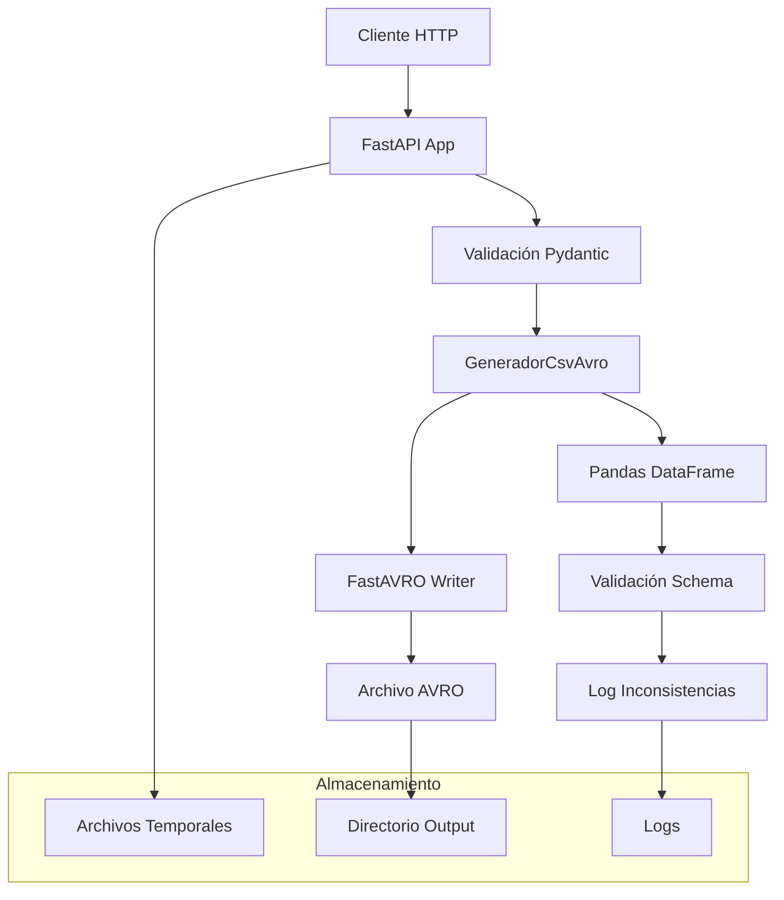
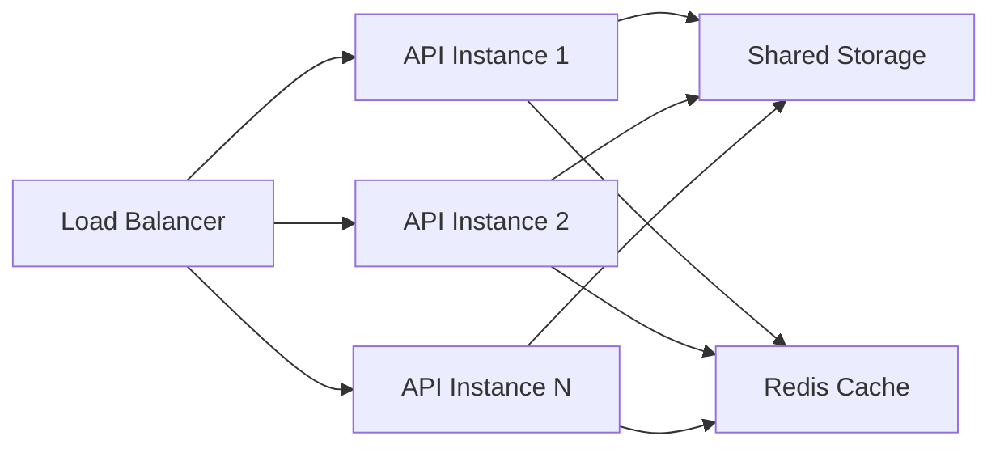

# Documentación Técnica - Microservicio CSV to AVRO

## 🏗️ Arquitectura del Sistema

### Componentes Principales



### Flujo de Procesamiento

```
1. Cliente envía POST request con archivos
2. FastAPI valida parámetros con Pydantic
3. Archivos se guardan temporalmente
4. Se instancia GeneradorCsvAvro
5. Se ejecuta conversión CSV → AVRO
6. Se valida contra esquema
7. Se generan reportes de inconsistencias
8. Se guarda archivo AVRO en output/
9. Se retorna respuesta JSON al cliente
```

---

## 🔧 Detalles de Implementación

### 1. **Modelo de Datos API**

```python
class ConversionRequest(BaseModel):
    tipo_entidad: int
    codigo_entidad: str
    nombre_entidad: str
    fecha_corte: int

class ConversionResponse(BaseModel):
    success: bool
    message: str
    registros_validos: int
    registros_invalidos: int
    inconsistencias: Optional[list] = None
    avro_file_path: Optional[str] = None
```

### 2. **Manejo de Archivos Temporales**

```python
with tempfile.TemporaryDirectory() as temp_dir:
    # Procesar archivos en directorio temporal
    # Se limpia automáticamente al finalizar
```

### 3. **Validaciones Implementadas**

#### Validación de Archivos
- ✅ Extensión `.csv` para archivos CSV
- ✅ Extensión `.json` para esquemas AVRO
- ✅ Validación JSON syntax para esquemas

#### Validación de Datos
- ✅ Tipos de datos según esquema AVRO
- ✅ Valores enum válidos
- ✅ Campos requeridos/opcionales
- ✅ Formato de registros

#### Validación de Parámetros
- ✅ `tipo_entidad` debe ser entero
- ✅ `codigo_entidad` debe ser string
- ✅ `fecha_corte` debe ser entero
- ✅ Archivos no pueden estar vacíos

---

## 📊 Manejo de Errores

### Códigos de Estado HTTP

| Código | Situación | Respuesta |
|--------|-----------|-----------|
| 200 | Conversión exitosa | `ConversionResponse` con datos |
| 400 | Archivo inválido | `{"detail": "El archivo debe ser un CSV"}` |
| 400 | JSON inválido | `{"detail": "El archivo de esquema no es un JSON válido"}` |
| 400 | Error validación | `{"detail": "Error de validación: ..."}` |
| 404 | Archivo no encontrado | `{"detail": "Archivo no encontrado"}` |
| 500 | Error interno | `{"detail": "Error interno: ..."}` |

### Manejo de Excepciones

```python
try:
    # Procesamiento principal
except ValueError as e:
    raise HTTPException(status_code=400, detail=f"Error de validación: {str(e)}")
except json.JSONDecodeError:
    raise HTTPException(status_code=400, detail="El archivo de esquema no es un JSON válido")
except Exception as e:
    raise HTTPException(status_code=500, detail=f"Error interno: {str(e)}")
```

---

## ⚡ Optimizaciones de Performance

### 1. **Gestión de Memoria**
- Uso de archivos temporales para procesar grandes datasets
- Liberación automática de recursos con context managers
- Streaming de archivos para evitar cargar todo en memoria

### 2. **Validación Eficiente**
- Validación temprana de formatos de archivo
- Validación incremental por registros
- Separación de registros válidos/inválidos para evitar reprocesamiento

### 3. **I/O Optimizado**
- Lectura/escritura de archivos con buffers adecuados
- Uso de `shutil.copyfileobj` para transferencia eficiente
- Directorio temporal local para reducir latencia de I/O

---

## 🛡️ Seguridad

### Medidas Implementadas

#### 1. **Validación de Archivos**
```python
# Validar extensiones
if not csv_file.filename.endswith('.csv'):
    raise HTTPException(status_code=400, detail="El archivo debe ser un CSV")

# Validar contenido JSON
try:
    with open(schema_path, 'r', encoding='utf-8') as f:
        json.load(f)
except json.JSONDecodeError:
    raise HTTPException(status_code=400, detail="El archivo de esquema no es un JSON válido")
```

#### 2. **Aislamiento de Procesos**
- Cada conversión usa directorio temporal único
- Limpieza automática de archivos temporales
- Sin persistencia de datos sensibles

#### 3. **Límites de Recursos**
- Archivos procesados en directorios temporales
- No hay almacenamiento permanente de datos de entrada
- Validación de tipos de datos para prevenir inyección

### Recomendaciones Adicionales de Seguridad

#### Para Producción:
- [ ] Implementar autenticación JWT/OAuth2
- [ ] Agregar rate limiting con Redis
- [ ] Validar tamaño máximo de archivos
- [ ] Implementar HTTPS obligatorio
- [ ] Logging de seguridad detallado
- [ ] Sanitización adicional de nombres de archivos

---

## 📈 Monitoreo y Observabilidad

### Endpoints de Salud

```python
@app.get("/health")
async def health_check():
    return {"status": "healthy", "service": "csv-to-avro-converter"}
```

### Métricas Propuestas

#### Métricas de Negocio
- Número de conversiones por hora/día
- Tamaño promedio de archivos procesados
- Porcentaje de registros válidos vs inválidos
- Tiempo promedio de procesamiento

#### Métricas Técnicas
- Latencia de respuesta por endpoint
- Uso de CPU y memoria
- Errores por tipo (4xx, 5xx)
- Throughput de requests por segundo

### Logging Estructurado

```python
import logging
import structlog

logger = structlog.get_logger()

# En cada endpoint
logger.info("conversion_started", 
    tipo_entidad=tipo_entidad,
    codigo_entidad=codigo_entidad,
    file_size=len(csv_content))
```

---

## 🔄 Escalabilidad

### Arquitectura Horizontal



### Estrategias de Escalado

#### 1. **Escalado Horizontal**
- Múltiples instancias del API
- Load balancer (nginx/HAProxy)
- Storage compartido para archivos de salida

#### 2. **Procesamiento Asíncrono**
```python
from celery import Celery

@app.post("/convert-async")
async def convert_async():
    task_id = process_conversion.delay(params)
    return {"task_id": task_id, "status": "processing"}
```

#### 3. **Cache de Resultados**
```python
import redis

redis_client = redis.Redis()

# Cache de esquemas frecuentes
schema_key = f"schema:{hash(schema_content)}"
cached_schema = redis_client.get(schema_key)
```

---

## 🐳 Containerización

### Dockerfile Propuesto

```dockerfile
FROM python:3.11-slim

WORKDIR /app

# Instalar dependencias del sistema
RUN apt-get update && apt-get install -y \
    gcc \
    && rm -rf /var/lib/apt/lists/*

# Copiar requirements e instalar dependencias Python
COPY requirements.txt .
RUN pip install --no-cache-dir -r requirements.txt

# Copiar código fuente
COPY . .

# Crear directorio de salida
RUN mkdir -p /app/output

# Configurar usuario no-root
RUN useradd -m -u 1000 appuser && chown -R appuser:appuser /app
USER appuser

# Exponer puerto
EXPOSE 8000

# Comando de inicio
CMD ["uvicorn", "api:app", "--host", "0.0.0.0", "--port", "8000"]
```

### Docker Compose

```yaml
version: '3.8'

services:
  csv-to-avro-api:
    build: .
    ports:
      - "8000:8000"
    volumes:
      - ./output:/app/output
      - ./logs:/app/logs
    environment:
      - REDIS_URL=redis://redis:6379
    depends_on:
      - redis

  redis:
    image: redis:alpine
    ports:
      - "6379:6379"

  nginx:
    image: nginx:alpine
    ports:
      - "80:80"
    volumes:
      - ./nginx.conf:/etc/nginx/nginx.conf
    depends_on:
      - csv-to-avro-api
```

---

## 🧪 Testing

### Estrategia de Testing

#### 1. **Unit Tests**
```python
import pytest
from fastapi.testclient import TestClient

def test_health_endpoint():
    response = client.get("/health")
    assert response.status_code == 200
    assert response.json()["status"] == "healthy"

def test_convert_with_valid_files():
    files = {"csv_file": ("test.csv", csv_content, "text/csv")}
    data = {"tipo_entidad": 1, ...}
    response = client.post("/convert", files=files, data=data)
    assert response.status_code == 200
```

#### 2. **Integration Tests**
```python
def test_full_conversion_workflow():
    # Test completo de extremo a extremo
    # 1. Subir archivos
    # 2. Verificar conversión
    # 3. Descargar resultado
    # 4. Validar contenido AVRO
```

#### 3. **Load Tests**
```python
# Con locust
from locust import HttpUser, task

class ConversionUser(HttpUser):
    @task
    def convert_file(self):
        files = {"csv_file": ("test.csv", self.csv_data)}
        self.client.post("/convert", files=files, data=self.form_data)
```

---

## 📦 Deployment

### Proceso de Despliegue

#### 1. **Desarrollo Local**
```bash
python api.py
# Server en http://localhost:8000
```

#### 2. **Staging**
```bash
docker build -t csv-avro-api:staging .
docker run -p 8000:8000 csv-avro-api:staging
```

#### 3. **Producción**
```bash
# Con Kubernetes
kubectl apply -f k8s/
# O con Docker Compose
docker-compose up -d
```

### Variables de Entorno

```bash
# Configuración del servidor
HOST=0.0.0.0
PORT=8000
DEBUG=false

# Configuración de almacenamiento
OUTPUT_DIR=/app/output
TEMP_DIR=/tmp

# Configuración de cache
REDIS_URL=redis://localhost:6379

# Configuración de logs
LOG_LEVEL=INFO
LOG_FORMAT=json
```

---

## 📋 Checklist de Producción

### Antes del Deploy

#### Código
- [ ] Tests unitarios pasando (>90% coverage)
- [ ] Tests de integración pasando
- [ ] Linting sin errores (flake8, black)
- [ ] Type checking sin errores (mypy)

#### Seguridad
- [ ] Autenticación implementada
- [ ] Rate limiting configurado
- [ ] HTTPS configurado
- [ ] Secrets management configurado

#### Performance
- [ ] Load testing realizado
- [ ] Métricas de performance documentadas
- [ ] Cache configurado apropiadamente
- [ ] Límites de recursos definidos

#### Operaciones
- [ ] Logging estructurado implementado
- [ ] Monitoreo configurado
- [ ] Alertas definidas
- [ ] Runbook de troubleshooting

#### Infraestructura
- [ ] Backups configurados
- [ ] Disaster recovery plan
- [ ] Escalado automático configurado
- [ ] Health checks implementados

---

*Documentación técnica actualizada el 20 de septiembre de 2025*  
*Versión del API: 1.0.0*
