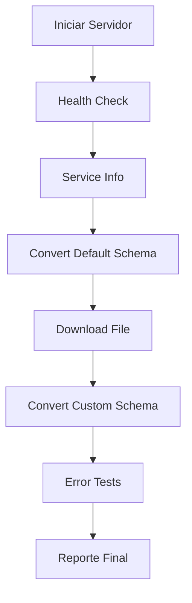

# 🧪 Guía de Pruebas con Postman - CSV to AVRO API

## 📋 Configuración Inicial

### 1. **Prerrequisitos**
- ✅ Postman instalado (Desktop o Web)
- ✅ Servidor API corriendo en http://localhost:8001
- ✅ Archivos de prueba disponibles (CSV y esquema AVRO)

### 2. **Verificar servidor**
Antes de importar a Postman, verifica que el servidor esté corriendo:

```bash
# El servidor debe estar activo en puerto 8001
curl http://localhost:8001/health
```

**Respuesta esperada:**
```json
{"status": "healthy", "service": "csv-to-avro-converter"}
```

---

## 📥 Importar Colección y Environment

### Paso 1: Importar la Colección

1. **Abrir Postman**
2. **Clic en "Import"** (esquina superior izquierda)
3. **Seleccionar "File"**
4. **Buscar y seleccionar**: `Postman_Collection.json`
5. **Clic en "Import"**

### Paso 2: Importar el Environment

1. **Clic en el ícono de engranaje** (Manage Environments)
2. **Clic en "Import"**
3. **Seleccionar**: `Postman_Environment.json`
4. **Clic en "Import"**

### Paso 3: Activar el Environment

1. **En el dropdown superior derecho**, seleccionar:
   `CSV to AVRO Converter Environment`

---

## 🏃‍♂️ Ejecutar Pruebas

### 🔸 **Opción 1: Pruebas Individuales**

#### 1. Health Check
- **Request**: `01 - Health Check`
- **Resultado esperado**: Status 200, `{"status": "healthy"}`

#### 2. Service Info
- **Request**: `02 - Service Info`
- **Resultado esperado**: Información del servicio con endpoints

#### 3. Conversión con Esquema por Defecto
- **Request**: `03 - Convert with Default Schema`
- **⚠️ IMPORTANTE**: Actualizar el path del archivo CSV
  - En el body, campo `csv_file`
  - Cambiar a la ruta absoluta: `D:\\Python\\convertcsvavro\\Data\\ArchivoCSV.csv`

#### 4. Conversión con Esquema Personalizado
- **Request**: `04 - Convert with Custom Schema`
- **⚠️ IMPORTANTE**: Actualizar paths de archivos:
  - `csv_file`: `D:\\Python\\convertcsvavro\\Data\\ArchivoCSV.csv`
  - `schema_file`: `D:\\Python\\convertcsvavro\\Esquema_AVRO.json`

#### 5. Descarga de Archivo AVRO
- **Request**: `05 - Download AVRO File`
- **Nota**: Se ejecuta automáticamente después del request #3

### 🔸 **Opción 2: Ejecución en Lote (Collection Runner)**

1. **Clic derecho en la colección** → "Run collection"
2. **Configurar**:
   - Environment: `CSV to AVRO Converter Environment`
   - Iterations: 1
   - Delay: 1000ms entre requests
3. **Clic en "Run CSV to AVRO Converter API"**

---

## ✅ Tests Automatizados Incluidos

### 🟢 **Tests de Éxito**

| Test | Verificación |
|------|-------------|
| Status Code | Códigos HTTP correctos (200, 400, 404, 422) |
| Response Structure | Estructura JSON esperada |
| Response Time | Tiempo < 500ms para health check |
| Success Flag | `success: true` en conversiones |
| File Content | Archivos AVRO generados tienen contenido |

### 🔴 **Tests de Error**

| Test | Escenario | Código Esperado |
|------|-----------|----------------|
| Invalid CSV | Enviar JSON como CSV | 400 |
| Missing Parameters | Faltan parámetros requeridos | 422 |
| File Not Found | Descargar archivo inexistente | 404 |

---

## 📊 Interpretación de Resultados

### ✅ **Respuesta Exitosa de Conversión**
```json
{
  "success": true,
  "message": "Conversión completada exitosamente",
  "registros_validos": 150,
  "registros_invalidos": 5,
  "inconsistencias": [
    "Fila 3: Campo 'tipo_garantia' valor 'INVALID' no es válido para enum TipoGarantia"
  ],
  "avro_file_path": "output/converted_default_1_123456_2024.avro"
}
```

### ❌ **Respuesta de Error**
```json
{
  "detail": "El archivo debe ser un CSV"
}
```

---

## 🔧 Personalización de Pruebas

### Modificar Parámetros de Conversión

Puedes cambiar los valores en el body de los requests:

```json
{
  "tipo_entidad": 1,           // Cambiar por tu valor
  "codigo_entidad": "123456",  // Cambiar por tu código
  "nombre_entidad": "TEST",    // Cambiar por tu nombre
  "fecha_corte": 2024         // Cambiar por tu fecha
}
```

### Agregar Nuevos Tests

Para agregar validaciones adicionales, editar la sección "Tests" de cada request:

```javascript
pm.test("Validación personalizada", function () {
    var jsonData = pm.response.json();
    pm.expect(jsonData.registros_validos).to.be.above(0);
});
```

---

## 🐛 Troubleshooting

### **Problema**: Error de conexión
**Solución**: 
```bash
# Verificar que el servidor esté corriendo
curl http://localhost:8001/health
# Si no responde, reiniciar servidor
python api.py
```

### **Problema**: Archivos no encontrados
**Solución**: 
- Verificar rutas absolutas en el body de los requests
- Asegurar que los archivos existan:
  - `Data/ArchivoCSV.csv`
  - `Esquema_AVRO.json`

### **Problema**: Tests fallan
**Solución**:
- Verificar que el environment esté activo
- Revisar las variables de environment
- Ejecutar requests individualmente primero

---

## 📈 Métricas y Reporting

### En Postman Collection Runner

Después de ejecutar todas las pruebas, verás:

- ✅ **Requests exitosos**: Número de pruebas que pasaron
- ❌ **Requests fallidos**: Número de pruebas que fallaron  
- ⏱️ **Tiempo total**: Duración de toda la suite
- 📊 **Tests passed**: Número de aserciones exitosas

### Exportar Resultados

1. **Después de ejecutar** → Clic en "Export Results"
2. **Seleccionar formato**: JSON o HTML
3. **Guardar reporte** para documentación

---

## 🔄 Flujo de Pruebas Recomendado



### Secuencia Recomendada:

1. **Health Check** - Verificar que el servicio esté activo
2. **Service Info** - Confirmar endpoints disponibles
3. **Conversión Default** - Probar funcionalidad básica
4. **Descarga** - Verificar generación de archivos
5. **Conversión Custom** - Probar con esquemas personalizados
6. **Tests de Error** - Validar manejo de errores
7. **Análisis** - Revisar resultados y métricas

---

## 🎯 Casos de Uso Adicionales

### Test de Carga Simple
1. Configurar Collection Runner con múltiples iteraciones
2. Aumentar iterations a 10-50
3. Reducir delay entre requests
4. Monitorear tiempos de respuesta

### Test con Diferentes Archivos
1. Crear variables de environment para diferentes archivos CSV
2. Duplicar requests con diferentes datasets
3. Comparar resultados de conversión

### Test de Validación de Datos
1. Crear CSVs con datos inválidos intencionalmente
2. Verificar que las inconsistencias se reporten correctamente
3. Validar que los registros válidos se procesen

---

**🚀 ¡Listo para empezar las pruebas!**

Ejecuta los requests en orden y revisa los resultados de los tests automatizados. Si todos pasan, tu API está funcionando perfectamente. 🎉
